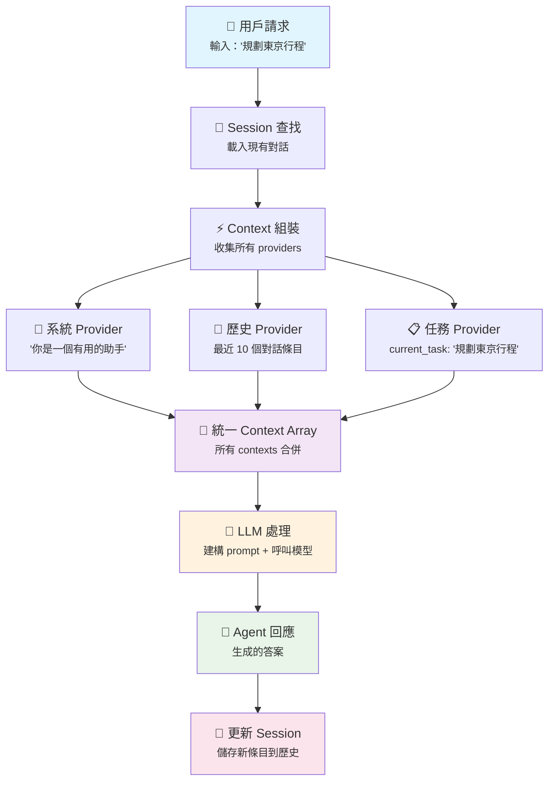

# go-agent

<div align="center">
  
  
  [](README.md) [](README-zh.md)
</div>

一個簡潔但功能完整的 Go 語言 AI Agent 框架。我們設計這個框架的目標是容易上手同時保持高度可擴充性，讓你能在 Go 專案中快速整合 AI agent 功能。

## 為什麼選擇 go-agent？

雖然市面上已經有很多優秀的 agent frameworks，但我們希望能創造一個專注於簡潔性和 Go 語言慣用設計的框架。我們的設計理念是「Context is Everything」+ **Easy to Start, Easy to Scale**：

**容易上手：**
- 一個 `Execute()` method 就能開始使用
- 清晰的 module 職責，不需要理解整個框架才能用
- 豐富的 examples 和文檔，看了就會用

**高度可擴充：**
- 模組化設計，可以只用需要的部分
- 清晰的 interface definitions，容易實作自訂功能
- 開放的 Provider pattern，可以整合任何 data sources

## 快速體驗

```go
package main

import (
    "context"
    "fmt"
    "log"
    
    "github.com/davidleitw/go-agent/agent"
    "github.com/davidleitw/go-agent/llm/openai"
)

func main() {
    // 建立 LLM model
    model := openai.New(llm.Config{
        APIKey: "your-openai-key",
        Model:  "gpt-4",
    })
    
    // 建立簡單的 Agent
    myAgent := agent.NewSimpleAgent(model)
    
    // 開始對話
    response, err := myAgent.Execute(context.Background(), agent.Request{
        Input: "幫我規劃一趟東京三日遊",
    })
    
    if err != nil {
        log.Fatal(err)
    }
    
    fmt.Println(response.Output)
    fmt.Printf("使用了 %d tokens\n", response.Usage.LLMTokens.TotalTokens)
}
```

## 框架架構

我們把複雜的 AI agent 功能拆解成幾個獨立但協調良好的 modules：

```
┌─────────────┐    ┌─────────────────────────────────────┐    ┌─────────────┐
│ User Input  │───▶│           Agent.Execute()            │───▶│   Response  │
└─────────────┘    └─────────────────┬───────────────────┘    └─────────────┘
                                     │
                        ┌────────────▼────────────┐
                        │  Step 1: Session Mgmt   │
                        │    (handleSession)      │
                        └────────────┬────────────┘
                                     │
                        ┌────────────▼────────────┐
                        │ Step 2: Context Gather  │
                        │   (gatherContexts)      │
                        └────────────┬────────────┘
                                     │
               ┌─────────────────────┼─────────────────────┐
               │                     │                     │
        ┌──────▼──────┐    ┌─────────▼──────┐    ┌─────────▼──────┐
        │System Prompt│    │    History     │    │    Custom      │
        │  Provider   │    │   Provider     │    │  Providers     │
        └─────────────┘    └────────────────┘    └────────────────┘
                                     │
                        ┌────────────▼────────────┐
                        │ Step 3: Execute Loop    │
                        │  (executeIterations)    │
                        │                         │
                        │  ┌─────────────────┐    │
                        │  │ Build Messages  │    │
                        │  └─────────┬───────┘    │
                        │            │            │
                        │  ┌─────────▼───────┐    │
                        │  │  LLM Call       │◄───┼──── Tool Registry
                        │  └─────────┬───────┘    │
                        │            │            │
                        │  ┌─────────▼───────┐    │
                        │  │ Tool Execution  │    │
                        │  └─────────┬───────┘    │
                        │            │            │
                        │        Iterate until    │
                        │        completion       │
                        └─────────────────────────┘
                                     │
                              ┌──────▼──────┐
                              │   Session   │
                              │   Storage   │
                              │ (TTL mgmt)  │
                              └─────────────┘
```

### Context Provider 系統 - 我們的獨特方法

讓 go-agent 與眾不同的是我們的**統一 Context 管理系統**。我們不是簡單的字串拼接，而是將 context 視為結構化資料在整個系統中流動。

**Provider Pattern：**
不同的 providers 提供不同類型的 context 資訊，全部統一成 LLM 能理解的一致格式：

```go
// 系統指令
systemProvider := context.NewSystemPromptProvider("你是一個有用的助手")

// 自動對話歷史 - 將 session entries 轉換為 contexts
historyProvider := context.NewHistoryProvider(10) // 最近 10 個條目

// 從 session 狀態讀取的自訂 provider
type TaskContextProvider struct{}

func (p *TaskContextProvider) Provide(ctx context.Context, s session.Session) []context.Context {
    // 從 session 狀態讀取當前任務
    if task, exists := s.Get("current_task"); exists {
        return []context.Context{{
            Type:    "task_context",
            Content: fmt.Sprintf("當前任務：%s", task),
            Metadata: map[string]any{
                "source": "session_state",
                "key":    "current_task",
            },
        }}
    }
    return nil
}

// 實際運作方式：
session.Set("current_task", "規劃東京行程")
session.AddEntry(session.NewMessageEntry("user", "天氣如何？"))
session.AddEntry(session.NewToolCallEntry("weather", map[string]any{"city": "Tokyo"}))
session.AddEntry(session.NewToolResultEntry("weather", "22°C, 晴朗", nil))

// 當 HistoryProvider 執行時，它會將 session entries 轉換為 contexts：
// - Message entries → user/assistant contexts  
// - Tool call entries → "Tool: weather\nParameters: {city: Tokyo}"
// - Tool result entries → "Tool: weather\nSuccess: true\nResult: 22°C, 晴朗"
// - TaskContextProvider 讀取 session.Get("current_task") → "當前任務：規劃東京行程"

agent, _ := agent.NewBuilder().
    WithLLM(model).
    WithContextProviders(systemProvider, historyProvider, &TaskContextProvider{}).
    Build()
```

**主要優勢：**
- **自動歷史管理**：Session 對話自動轉換為 context
- **豐富的 Metadata**：每個 context 都包含 metadata 用於除錯和分析
- **TTL 整合**：Context providers 與 session 過期機制無縫配合
- **可擴展性**：輕鬆新增新的 context sources（databases、APIs、files 等）

這個方法讓「Context is Everything」不只是理念，而是從簡單 chatbots 到複雜多模態 agents 都能擴展的實際實作。

### Context vs Session - 關鍵概念釐清

理解這兩個核心概念的區別很重要：

**Context** = 資訊食材（短暫的、無狀態的）
- 每次執行時重新組裝
- 用來建構 LLM prompts
- 例如：系統指令、最近訊息、當前用戶偏好

**Session** = 狀態冰箱（持久的、有狀態的）
- 跨多次執行持續存在
- 儲存對話歷史和變數
- 例如：用戶設定、對話歷史、TTL 管理

以下展示每次請求時 contexts 如何動態組裝：



精髓在於 **Context** 每次都從持久的 **Session** 狀態重新組裝，確保一致性和靈活性。

### [Agent 模組](./agent/) - 核心控制器
這是整個框架的大腦，負責協調其他所有 modules。提供了簡單的 `Execute()` interface 和靈活的 Builder pattern 讓你能輕鬆配置各種功能。

**主要特色：**
- 簡潔的 `Agent` interface，一個方法搞定所有事情
- Builder pattern 讓配置變得很直觀
- 自動 session management，不用擔心 state 問題
- 內建的 convenience functions，常見用法一行搞定

### [Session 模組](./session/) - 記憶管理
負責管理對話的 state 和 history records。支援 TTL 自動過期、concurrent safety、還有完整的 JSON serialization。

**主要特色：**
- Key-Value state storage，什麼資料都能放
- 統一的 history record format，支援多種對話類型
- 自動 TTL management，過期 sessions 會自動清理
- Thread-safe，多 goroutine 使用沒問題

### [Context 模組](./context/) - 資訊聚合
這個模組的工作是把各種來源的資訊（history conversations、system prompts、external data 等）統一打包成 LLM 能理解的格式。

**主要特色：**
- 統一的 `Context` data structure
- 可擴展的 `Provider` system
- 自動將 Session history 轉換成 contexts
- 豐富的 metadata 支援

### [Tool 模組](./tool/) - 工具整合
讓你的 AI agents 能夠呼叫外部功能，比如查詢資料庫、呼叫 API、執行計算等等。

**主要特色：**
- 簡單的 `Tool` interface，很容易實作自訂 tools
- 基於 JSON Schema 的 parameter definitions
- Thread-safe 的 tool registry
- 完整的 error handling 機制

### [LLM 模組](./llm/) - 語言模型介面
提供統一的 language model interface，目前支援 OpenAI，未來會擴展到其他提供商。

**主要特色：**
- 清晰的 `Model` interface
- 內建 tool calling 支援
- 完整的 token usage tracking
- 支援 custom endpoints 和 proxies

## 目前開發狀態

**已經可以用的功能：**
- 完整的 module interfaces 設計和實作
- Session management 和 TTL 支援
- Context provider system
- Tool registration 和 execution framework
- OpenAI 整合
- 豐富的 test coverage

**正在開發中：**
- Agent 的核心 execution logic（LLM calls、tool orchestration、iterative thinking 等）
- 更多 LLM providers 支援
- Streaming responses 支援
- 更多內建 tools 和範例

**未來計劃：**
- Redis/Database 的 Session storage
- Async tool execution
- 更進階的 Context management 功能
- MCP (Model Context Protocol) tool 整合

## 設計哲學

### "Context is Everything"
我們相信 AI agents 的核心就是管理 context。不管是 conversation history、user preferences、external data，或是 tool execution results，都需要以一致的方式提供給 LLM。

我們計劃組織相關的 talks 並整理 Context Engineering 的資源，幫助社群更好地理解這個方法。

## 參與開發

這個專案還在積極開發中，我們非常歡迎各種形式的參與：

**Interface 設計討論（最重要！）：**
- 覺得某個 interface 設計不夠直觀嗎？
- 有更好的 API 設計想法嗎？
- 認為某些功能的抽象層次不對嗎？
- 希望某個 module 提供不同的使用方式嗎？

我們深信好的 interface design 是框架成功的關鍵，任何對 interfaces 有想法的朋友都非常歡迎提出討論！

**功能建議：**
- 希望增加什麼新功能？
- 遇到什麼使用上的困難？
- 有什麼實際 application scenarios 我們沒考慮到？

**程式碼貢獻：**
- 實作新的 LLM providers
- 建立更多實用的 tools
- 改善 performance 和 stability
- 增加更多 tests 和 examples

**文檔和範例：**
- 撰寫使用教學
- 建立實際的 application examples
- 翻譯文檔

隨時可以開 Issue 討論，或者直接發 PR。我們很樂意跟大家一起把這個框架做得更好用。

## 如何開始

1. **查看 module 文檔**：每個資料夾都有詳細的 README，建議先從 [Agent 模組](./agent/) 開始看
2. **執行測試**：`go test ./...` 看看所有功能是否正常
3. **加入討論**：有問題或想法就開 Issue 聊聊

## 授權

MIT License - 想怎麼用就怎麼用，但我們不負責任何損失喔。

---

**專案狀態：積極開發中** | **最後更新：2024**

期待看到你用這個框架做出什麼有趣的東西！